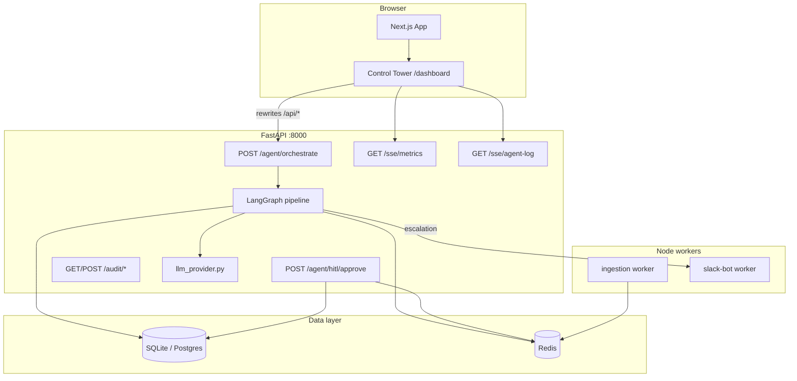

# NexusFlow AI

**Multi-agent autonomous operations platform** for logistics and regional ops — natural-language command routing, LangGraph orchestration, real-time Control Tower dashboard, human-in-the-loop (HITL) approvals, and optional Slack escalation.

Built as a production-style portfolio monorepo: **Next.js 15** frontend, **FastAPI** backend, **Redis** event bus, **TypeScript workers**, and **Docker Compose** for local full-stack development.

---

## Table of contents

- [Features](#features)
- [Architecture](#architecture)
- [Tech stack](#tech-stack)
- [Repository structure](#repository-structure)
- [Prerequisites](#prerequisites)
- [Quick start](#quick-start)
- [Environment variables](#environment-variables)
- [Control Tower](#control-tower)
- [LangGraph pipeline](#langgraph-pipeline)
- [LLM providers](#llm-providers)
- [API reference](#api-reference)
- [Workers](#workers)
- [Docker Compose](#docker-compose)
- [Development](#development)
- [Deployment notes](#deployment-notes)
- [Troubleshooting](#troubleshooting)
- [License](#license)

---

## Features

| Capability | Description |
|------------|-------------|
| **Natural-language orchestration** | Submit logistics queries in plain English; the agent parses intent, fetches metrics, analyzes severity, decides actions, and dispatches. |
| **LangGraph 5-node pipeline** | `parse` → `fetch` → `analyze` → `decide` → `dispatch` with structured state and execution path tracking. |
| **Multi-provider LLM** | Switch providers via `LLM_PROVIDER`: Anthropic, OpenAI, Ilmu (MY), or heuristic fallback without API keys. |
| **Control Tower UI** | Dashboard at `/dashboard` with NL command bar, live SSE metrics, agent activity log, and HITL approve/reject. |
| **HITL + Slack** | High-severity decisions escalate to Slack; operators approve or reject from the dashboard. |
| **Audit trail** | Persisted orchestration and HITL events (SQLite by default; Postgres via `DATABASE_URL`). |
| **SSE streaming** | Regional metrics and agent log streams for the dashboard. |
| **Redis pub/sub** | Cross-process agent events; in-memory fallback when Redis is unavailable. |
| **Ingestion worker** | Periodic traffic samples (Federal Highway / LDP fetchers) published to Redis. |
| **Slack Bolt worker** | Socket Mode–ready bot scaffold for workspace integration. |

---

## Architecture



**Request flow (orchestrate):**

1. User submits a query on the Control Tower.
2. Frontend proxies to `POST /agent/orchestrate`.
3. LangGraph runs five nodes; each node can publish to the agent-log SSE channel.
4. Decisions requiring approval trigger Slack (if configured) and set `execution_status: escalated`.
5. Results and audit rows are stored; response includes `llm_mode`, `execution_path`, and analysis.

---

## Tech stack

| Layer | Technology |
|-------|------------|
| Frontend | Next.js 15 (App Router), React, TypeScript, Tailwind CSS, Framer Motion |
| Backend | FastAPI, Python 3.10+, LangGraph, SQLAlchemy (async), Pydantic Settings |
| LLM | Anthropic SDK, OpenAI SDK (OpenAI + Ilmu-compatible), heuristic fallback |
| Cache / events | Redis 7 (optional Upstash REST in workers) |
| Database | SQLite (`backend/data/`) dev default; Neon / Supabase Postgres in production |
| Workers | Node.js, TypeScript, Slack Bolt |
| Monorepo | pnpm workspaces |
| Containers | Docker Compose |

---

## Repository structure

```
nexusflow-ai/
├── frontend/                 # Next.js 15 app
│   └── src/
│       ├── app/              # pages: /, /dashboard
│       └── components/       # Control Tower dashboard
├── backend/                  # FastAPI service
│   └── src/
│       ├── agent/            # LangGraph orchestration
│       ├── api/routes/       # agent, sse, audit
│       ├── db/               # models, session
│       └── services/         # llm, redis, slack, audit
├── workers/
│   ├── ingestion/            # traffic ingestion → Redis
│   └── slack-bot/            # Slack Bolt worker
├── docker-compose.yml
├── pnpm-workspace.yaml
└── package.json
```

---

## Prerequisites

- **Node.js** 18.17+
- **pnpm** 8+ (`npm install -g pnpm`)
- **Python** 3.10+
- **Docker** 24+ (optional, recommended for Redis + full stack)

---

## Quick start

### 1. Clone and install

```bash
git clone https://github.com/timothylee58/nexusflow-ai.git
cd nexusflow-ai
pnpm install
cd backend && python -m pip install -r requirements.txt && cd ..
```

If `pnpm install` fails with **ENOSPC**, free disk space or clear package caches, then retry.

### 2. Configure backend (LLM optional)

```bash
cp backend/.env.example backend/.env.local
```

Edit `backend/.env.local` — see [Environment variables](#environment-variables). You can run without any API key (`LLM_PROVIDER=heuristic`).

### 3. Run (manual — two terminals)

**Terminal A — backend**

```bash
cd backend
python -m uvicorn src.main:app --reload --port 8000
```

**Terminal B — frontend**

```bash
cd frontend
pnpm dev
```

### 4. Open the app

| URL | Purpose |
|-----|---------|
| http://localhost:3000 | Home (health check) |
| http://localhost:3000/dashboard | **Control Tower** |
| http://localhost:8000/docs | OpenAPI (Swagger) |
| http://localhost:8000/status | LLM provider + infra status |

### 5. Smoke test

```bash
curl http://127.0.0.1:8000/health
curl http://127.0.0.1:8000/status
```

```bash
python -c "import httpx; print(httpx.post('http://127.0.0.1:8000/agent/orchestrate', json={'query':'Show KL delivery bottlenecks','user_id':'demo'}).json())"
```

---

## Environment variables

Copy each package’s `.env.example` to `.env.local` (gitignored). **Never commit** real API keys.

| Package | Template | Used for |
|---------|----------|----------|
| `backend/` | `backend/.env.example` | LLM, DB, Redis, Slack, FastAPI |
| `frontend/` | `frontend/.env.example` | API URL for browser / SSR |
| `workers/ingestion/` | `workers/ingestion/.env.example` | Redis, traffic APIs |
| `workers/slack-bot/` | `workers/slack-bot/.env.example` | Slack tokens |

The backend loads **`backend/.env.local`** then **`backend/.env`** (first wins per Pydantic settings order: `.env.local` is listed first).

### Backend — LLM (put keys here)

```env
LLM_PROVIDER=auto
# auto | heuristic | anthropic | openai | ilmu

# Anthropic
ANTHROPIC_API_KEY=
ANTHROPIC_PARSE_MODEL=claude-3-5-haiku-20241022
ANTHROPIC_ANALYSIS_MODEL=claude-3-5-sonnet-20241022

# OpenAI (or compatible endpoint)
OPENAI_API_KEY=
OPENAI_BASE_URL=
OPENAI_PARSE_MODEL=gpt-4o-mini
OPENAI_ANALYSIS_MODEL=gpt-4o

# Ilmu — Malaysia sovereign LLM (OpenAI-compatible)
ILMU_API_KEY=
ILMU_BASE_URL=https://api.ilmu.ai/v1
ILMU_PARSE_MODEL=ilmu-nemo-nano
ILMU_ANALYSIS_MODEL=nemo-super
```

### Backend — data & integrations

```env
DATABASE_URL=                    # empty = SQLite at backend/data/nexusflow.db
REDIS_URL=redis://localhost:6379/0
SLACK_BOT_TOKEN=
SLACK_SIGNING_SECRET=
SLACK_CHANNEL_ID=
ENVIRONMENT=development
DEBUG=true
LOG_LEVEL=INFO
```

### Frontend

```env
NEXT_PUBLIC_API_URL=http://localhost:8000
# Docker / SSR: INTERNAL_API_URL=http://backend:8000
```

### Workers

**Ingestion:** `REDIS_URL`, optional `TRAFFIC_API_KEY`, `INGESTION_INTERVAL_MS`, `INGESTION_REDIS_CHANNEL`

**Slack bot:** `SLACK_BOT_TOKEN`, `SLACK_SIGNING_SECRET`, optional `SLACK_APP_LEVEL_TOKEN` (Socket Mode)

---

## Control Tower

The Control Tower (`frontend/src/app/dashboard/page.tsx`) is the operator console:

- **Command bar** — natural-language queries → `POST /api/agent/orchestrate`
- **Metrics grid** — `EventSource` on `/api/sse/metrics` (regional congestion mock stream)
- **Agent log** — `/api/sse/agent-log` (Redis pub/sub or in-memory)
- **HITL panel** — approve/reject → `POST /api/agent/hitl/approve`

Next.js rewrites `/api/agent/*`, `/api/audit/*`, and `/api/sse/*` to the FastAPI backend (`frontend/next.config.ts`).

---

## LangGraph pipeline

Implementation: `backend/src/agent/langgraph_orchestration.py`

| Node | Responsibility |
|------|----------------|
| `parse` | NL → structured `ParsedCommand` (region, metric, query type) |
| `fetch` | Load metrics for region (demo synthetic data; extensible to live feeds) |
| `analyze` | Severity, summary, root causes |
| `decide` | Action type, HITL flag, estimated impact |
| `dispatch` | Auto-execute or escalate to Slack |

State is typed as `DispatcherState` with `execution_path` and `errors` for observability.

---

## LLM providers

Gateway: `backend/src/services/llm_provider.py`

| `LLM_PROVIDER` | Behavior |
|----------------|----------|
| `auto` (default) | Ilmu → Anthropic → OpenAI → heuristic |
| `ilmu` | OpenAI-compatible client → `ILMU_BASE_URL` |
| `anthropic` | Claude (Haiku parse, Sonnet analyze) |
| `openai` | OpenAI or custom `OPENAI_BASE_URL` |
| `heuristic` | Rule-based parser/analyzer — no API key |

Orchestration responses include `"llm_mode": "<provider>"`. Check active provider:

```bash
curl http://127.0.0.1:8000/status
```

---

## API reference

Base URL: `http://localhost:8000` (or proxied via frontend `/api`).

### System

| Method | Path | Description |
|--------|------|-------------|
| `GET` | `/health` | Liveness |
| `GET` | `/status` | Environment, Redis, LLM provider, DB hint |
| `GET` | `/docs` | Swagger UI |

### Agent

| Method | Path | Body | Description |
|--------|------|------|-------------|
| `POST` | `/agent/orchestrate` | `{ "query": string, "user_id"?: string }` | Run full LangGraph pipeline |
| `POST` | `/agent/hitl/approve` | `{ "decision_id": string, "approval_choice": "approve"\|"reject", "user_id"?: string, "notes"?: string }` | HITL decision |

**Orchestrate response (abbreviated):**

```json
{
  "action_id": "uuid",
  "parsed_command": { "query_type": "bottleneck", "region": "MY", "metric": "delivery_time", ... },
  "analysis": { "summary": "...", "severity": "high", "model": "...", ... },
  "decision": { "decision_type": "alert_hitl", "requires_approval": true, ... },
  "execution_status": "escalated",
  "execution_path": ["parse", "fetch", "analyze", "decide", "dispatch"],
  "llm_mode": "heuristic",
  "errors": []
}
```

### SSE

| Method | Path | Description |
|--------|------|-------------|
| `GET` | `/sse/metrics` | `text/event-stream` — regional metrics updates |
| `GET` | `/sse/agent-log` | `text/event-stream` — LangGraph node events |

### Audit

| Method | Path | Description |
|--------|------|-------------|
| `POST` | `/audit/log` | Append audit event |
| `GET` | `/audit/recent?limit=20` | Recent audit rows |

---

## Workers

### Ingestion (`workers/ingestion`)

Publishes traffic samples to Redis channel `nexusflow:traffic` (configurable). Uses Federal Highway and LDP fetcher stubs; runs heartbeats when `TRAFFIC_API_KEY` is unset.

```bash
cd workers/ingestion && pnpm dev
```

### Slack bot (`workers/slack-bot`)

Slack Bolt app — starts when `SLACK_BOT_TOKEN` and `SLACK_SIGNING_SECRET` are set. Socket Mode optional via `SLACK_APP_LEVEL_TOKEN`.

```bash
cd workers/slack-bot && pnpm dev
```

---

## Docker Compose

Runs Redis, backend, frontend, ingestion, and slack-bot together.

```bash
docker compose up -d
docker compose ps
docker compose logs -f backend
```

| Service | Port | Notes |
|---------|------|-------|
| `redis` | 6379 | Health-checked |
| `backend` | 8000 | Loads `backend/.env.docker`; set secrets via `backend/.env.local` + compose override |
| `frontend` | 3000 | `INTERNAL_API_URL=http://backend:8000` |
| `ingestion` | — | Publishes to Redis |
| `slack-bot` | — | Idles without Slack tokens |

To inject LLM keys in Docker, add `env_file: ./backend/.env.local` under `backend` in `docker-compose.yml` or use a `docker-compose.override.yml` (gitignored).

---

## Development

### Root scripts

```bash
pnpm dev:frontend      # Next.js :3000
pnpm dev:ingestion     # Ingestion worker
pnpm dev:slack-bot     # Slack worker
```

### Backend layout conventions

- Routes: `backend/src/api/routes/`
- Business logic: `backend/src/services/`
- LangGraph: `backend/src/agent/`
- Pydantic settings: `backend/src/config.py`

### Frontend conventions

- App Router, Server Components by default
- Control Tower is a client component (SSE + interactions)
- Mobile-first Tailwind styling

### Pre-commit checks (recommended)

```bash
cd frontend && pnpm exec tsc --noEmit
cd backend && python -m pip install ruff && ruff check backend/src
```

---

## Deployment notes

| Component | Suggested target |
|-----------|------------------|
| Frontend | Vercel (set `NEXT_PUBLIC_API_URL` to production API) |
| Backend | Railway, Render, or container host |
| Redis | Upstash, ElastiCache, or managed Redis |
| Database | Neon, Supabase Postgres (`DATABASE_URL`) |

- Set `DATABASE_URL` for production (SQLite is dev-only).
- Restrict CORS in `backend/src/main.py` for production origins.
- Use `REDIS_URL` for SSE agent-log across multiple API instances.
- Store secrets in platform env vars, not in the image.

---

## Troubleshooting

| Issue | Fix |
|-------|-----|
| `llm_mode: heuristic` with keys set | Restart backend after editing `backend/.env.local`; verify `GET /status` shows `llm_configured: true` |
| Dashboard cannot reach API | Ensure backend on :8000; check `NEXT_PUBLIC_API_URL` |
| Agent log empty in UI | Set `REDIS_URL`; without Redis, in-memory bus works only in the same process |
| `pnpm install` ENOSPC | Free disk space; clear `node_modules` and retry |
| Slack HITL not posting | Set `SLACK_BOT_TOKEN` + `SLACK_CHANNEL_ID` in backend `.env.local` |
| Docker backend has no LLM | Mount or `env_file` `backend/.env.local` into the backend service |

---

## License

MIT — see [LICENSE](LICENSE). Portfolio / demonstration use; configure your own API keys and data sources before production use.

---

## Author

**Timothy Lee** — Full-stack / AI engineering (Malaysia & remote).

Repository: [github.com/timothylee58/nexusflow-ai](https://github.com/timothylee58/nexusflow-ai)
